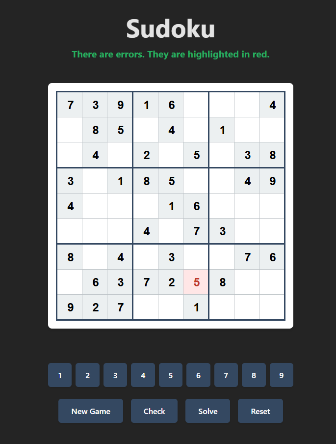
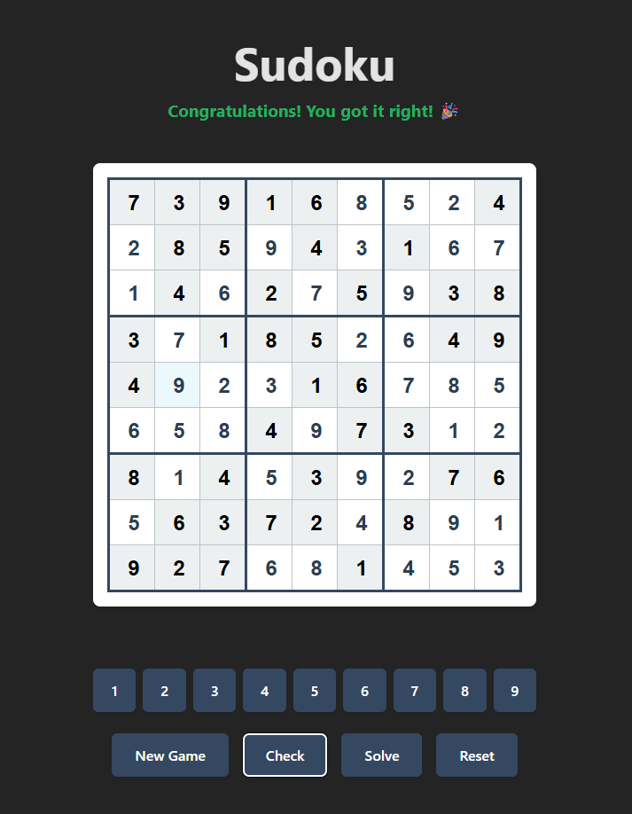

# Sudoku Game

A fully functional Sudoku game built with React, TypeScript, and Vite.

🎮 **[Play Live Demo](https://diz1l.github.io/Sudoku/)**

## Screenshots

<div align="center">
  
  
</div>

## Features

- **Random Puzzle Generation**: Generates valid Sudoku puzzles using backtracking algorithm
- **Interactive Grid**: Click cells and use number buttons to fill in values
- **Protected Cells**: Prefilled cells cannot be overwritten
- **Validation**: Check your solution for errors with visual feedback
- **Error Highlighting**: Invalid cells are highlighted in red
- **Game Controls**:
  - **New Game**: Generate a fresh puzzle
  - **Check**: Validate current solution
  - **Solve**: Reveal the complete solution
  - **Reset**: Restore puzzle to initial state
- **Responsive Design**: Mobile-friendly layout with adaptive breakpoints

## How It Works

### Core Architecture

```
src/
├── App.tsx              # Main component (UI only)
├── hooks/
│   └── useGameState.ts  # Custom hook with all game logic
├── component/
│   ├── grid.tsx         # Sudoku grid renderer
│   └── buttons.tsx      # Number and control buttons
└── utils/
    └── sudoku.ts        # Puzzle generation and validation
```

### Game State Management

The application uses a custom hook (`useGameState`) that manages:

- **board**: Current game state (user-editable)
- **puzzle**: Initial puzzle state (read-only reference)
- **solution**: Complete valid solution (for validation)
- **invalidCells**: Set of cells with errors
- **message**: User feedback messages

### Puzzle Generation Algorithm

1. **Board Filling** (`fillBoard`):
   - Backtracking algorithm fills empty 9×9 grid
   - Randomly shuffles numbers 1-9 for each cell
   - Validates move using Sudoku rules (row, column, 3×3 block)
   - Recursively tries next cell or backtracks on failure

2. **Puzzle Creation** (`createFullBoard`):
   - Takes completed board as input
   - Randomly removes specified number of cells (default: 40)
   - Returns puzzle with empty cells

### Validation Logic

The `isValidMove` function checks three Sudoku rules:
- Number doesn't exist in the same row
- Number doesn't exist in the same column
- Number doesn't exist in the same 3×3 block

## Technologies

- **React 18** with TypeScript
- **Vite** for fast development and building
- **CSS Variables** for theming
- **Custom Hooks** for state management

## Getting Started

```bash
# Install dependencies
npm install

# Run development server
npm run dev

# Build for production
npm run build
```

## Possible Improvements

### Gameplay Features
- [ ] **Difficulty Levels**: Easy/Medium/Hard/Expert with varying empty cells
- [ ] **Notes/Pencil Marks**: Allow users to mark possible candidates in cells
- [ ] **Hint System**: Reveal one correct cell on demand
- [ ] **Undo/Redo**: History of moves with ability to reverse
- [ ] **Keyboard Input**: Support arrow keys and number keys
- [ ] **Cell Highlighting**: Highlight selected row, column, and 3×3 block
- [ ] **Auto-Check Mode**: Real-time validation as user types

### Progress Tracking
- [ ] **Timer**: Track time spent on puzzle
- [ ] **Mistake Counter**: Limit number of errors allowed
- [ ] **Score System**: Points based on time and mistakes
- [ ] **Statistics**: Track win rate, average time, best scores
- [ ] **Daily Challenge**: New puzzle each day with global leaderboard

### Visual Enhancements
- [ ] **Animations**: Smooth transitions for cell updates
- [ ] **Dark Mode**: Toggle between light/dark themes
- [ ] **Sound Effects**: Audio feedback for valid/invalid moves
- [ ] **Confetti Animation**: Celebration on puzzle completion
- [ ] **Custom Themes**: Multiple color schemes to choose from

### Technical Improvements
- [ ] **Local Storage**: Save progress automatically
- [ ] **Multiple Puzzles**: Pre-generate batch of puzzles
- [ ] **Solver Algorithm**: Alternative solving strategies (not just backtracking)
- [ ] **Puzzle Validator**: Ensure generated puzzles have unique solutions
- [ ] **Performance**: Memoization for grid rendering
- [ ] **Testing**: Unit tests for validation and generation logic
- [ ] **Accessibility**: ARIA labels, keyboard navigation, screen reader support

### Advanced Features
- [ ] **Multiplayer**: Race against others on same puzzle
- [ ] **Puzzle Editor**: Allow users to create custom puzzles
- [ ] **Import/Export**: Load puzzles from external sources
- [ ] **Step-by-Step Solver**: Show solving process with explanations
- [ ] **Techniques Library**: Teach Sudoku solving strategies

## Project Structure Details

### State Flow

```
User clicks cell → setSelectedNumber([row, col])
User clicks number button → setSelectButton(number)
useEffect triggers → Updates board if cell is editable
```

### Validation Flow

```
User clicks Check → handleCheck()
Loop through all cells → Compare with solution
Invalid cells → Add to invalidCells Set
Update message → Display result
```
